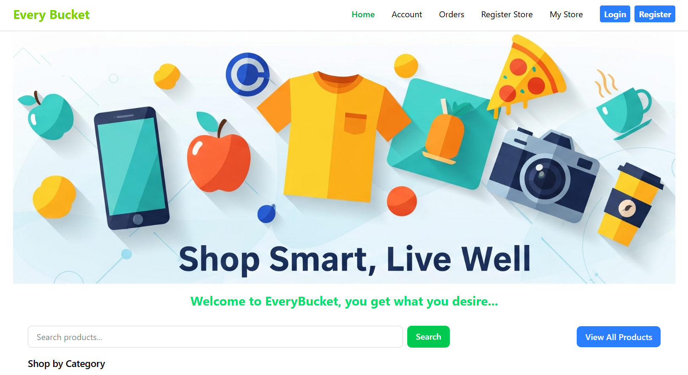
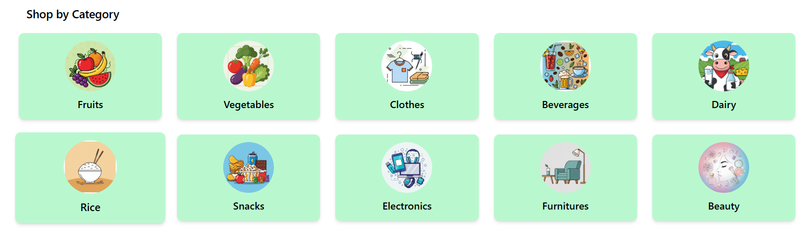
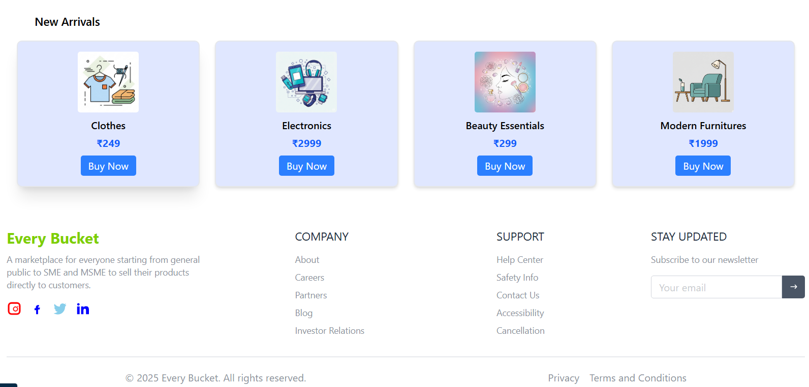

## MERN E-Commerce Marketplace

Welcome to the MERN E-Commerce Marketplace! This is an open online marketplace designed for the general public, as well as SMEs and MSMEs, to buy and sell products with ease. The platform empowers small businesses and individuals to reach a wider audience and manage their stores efficiently unlike other platforms where big corporates dominates.

### Key Features

- User-friendly interface for buyers and sellers
- Product listing, search, and filtering
- Seller dashboard for product and order management
- Secure authentication and checkout process
- Responsive design for all devices
- Image upload and preview for products

### Who is it for?

This marketplace is open to everyone, but especially built for:

- General public looking for a wide variety of products
- Small and Medium Enterprises (SMEs)
- Micro, Small, and Medium Enterprises (MSMEs)

### Tech Stack

- **Frontend:** React, Vite, Tailwind CSS
- **Backend:** Node.js, Express, MongoDB
- **Other:** Docker, REST APIs

### Home Page Preview

Some sample images from the home page:

 
 

---

**Empowering local businesses and communities through technology.**

thank you.
